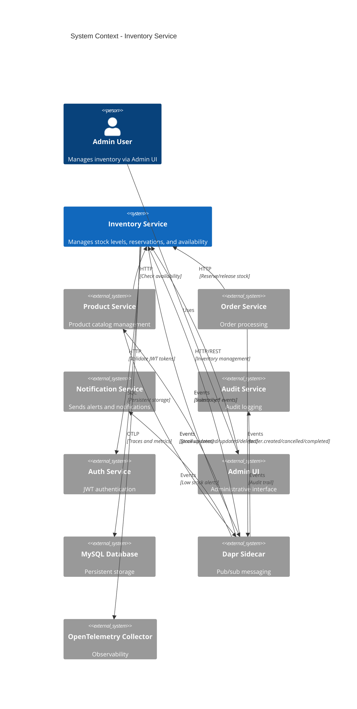
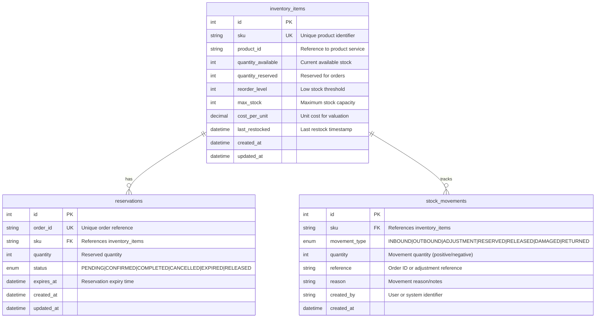

# Inventory Service - Architecture Document

## Table of Contents

1. [Overview](#1-overview)
2. [System Context](#2-system-context)
3. [Data Architecture](#3-data-architecture)
4. [API Design](#4-api-design)
5. [Event Architecture](#5-event-architecture)
6. [Configuration & Deployment](#6-configuration--deployment)
7. [Security](#7-security)

---

## 1. Overview

### 1.1 Purpose

The Inventory Service is a core microservice within the xshopai e-commerce platform responsible for managing stock levels, reservations, and product availability across all warehouses. It serves as the **single source of truth** for product availability data and provides both synchronous APIs and event-driven integration patterns for real-time inventory updates.

### 1.2 Service Summary

| Attribute      | Value                                       |
| -------------- | ------------------------------------------- |
| Service Name   | inventory-service                           |
| Tech Stack     | Python 3.x / Flask 3.0 / Flask-RESTX        |
| Database       | MySQL 8.x (SQLAlchemy ORM + PyMySQL driver) |
| Migrations     | Flask-Migrate (Alembic)                     |
| Cache          | None (Redis integration removed)            |
| API Docs       | Swagger/OpenAPI via Flask-RESTX             |
| Messaging      | Dapr Pub/Sub (abstracted via DaprProvider)  |
| Main Port      | 8004                                        |
| Dapr HTTP Port | 3504                                        |
| Dapr gRPC Port | 50004                                       |

### 1.3 Key Responsibilities

1. **Stock Management** - Track real-time stock levels by SKU and warehouse; handle stock adjustments (received, damaged, returned)
2. **Reservation System** - Create time-bound reservations during checkout; auto-expire uncommitted reservations; confirm reservations on order placement
3. **Event Publishing** - Publish `inventory.stock.updated`, `inventory.reserved`, `inventory.released` events for downstream services
4. **Stock Queries** - Provide availability checks for Product Service (denormalized status) and Order Service (validation)
5. **Admin Operations** - Bulk stock updates, low-stock threshold configuration, inventory auditing

### 1.4 References

| Document             | Link                                                                  |
| -------------------- | --------------------------------------------------------------------- |
| PRD                  | [docs/PRD.md](./PRD.md)                                               |
| Copilot Instructions | [.github/copilot-instructions.md](../.github/copilot-instructions.md) |

---

## 2. System Context

### 2.1 Context Diagram



### 2.2 External Interfaces

| System               | Direction | Protocol    | Description                                         |
| -------------------- | --------- | ----------- | --------------------------------------------------- |
| Product Service      | In        | HTTP        | Queries stock availability for products             |
| Product Service      | In        | Dapr Events | Receives product.created/updated/deleted events     |
| Order Service        | In        | HTTP        | Reserve and release inventory for orders            |
| Order Service        | In        | Dapr Events | Receives order.created/cancelled/completed events   |
| Auth Service         | Out       | HTTP        | JWT token validation for protected endpoints        |
| Admin UI             | In        | HTTP        | Administrative inventory management                 |
| Product Service      | Out       | Dapr Events | Publishes inventory.stock.updated events            |
| Notification Service | Out       | Dapr Events | Publishes inventory.low.stock alerts                |
| Audit Service        | Out       | Dapr Events | Publishes inventory change events for audit logging |
| MySQL                | Out       | SQL         | Persistent storage for inventory and reservations   |

### 2.3 Dependencies

#### 2.3.1 Upstream Dependencies

| Service         | Dependency Type | Purpose                                      |
| --------------- | --------------- | -------------------------------------------- |
| Product Service | Event           | Sync inventory records when products change  |
| Order Service   | Event           | Process order-related inventory operations   |
| Auth Service    | HTTP            | JWT validation for admin/protected endpoints |

#### 2.3.2 Downstream Consumers

| Consumer             | Interface   | Data Provided                               |
| -------------------- | ----------- | ------------------------------------------- |
| Product Service      | HTTP        | Stock availability queries                  |
| Product Service      | Dapr Events | inventory.stock.updated, inventory.created  |
| Order Service        | HTTP        | Reserve/release/check operations            |
| Order Service        | Dapr Events | inventory.reserved, inventory.released      |
| Notification Service | Dapr Events | inventory.low.stock, inventory.out.of.stock |
| Audit Service        | Dapr Events | All inventory change events                 |
| Admin UI             | HTTP        | Full inventory management API               |

#### 2.3.3 Infrastructure Dependencies

| Component               | Purpose                       | Port/Connection          |
| ----------------------- | ----------------------------- | ------------------------ |
| MySQL 8.x               | Persistent storage            | 3306 (configurable)      |
| Dapr Sidecar            | Pub/sub messaging             | HTTP: 3504, gRPC: 50004  |
| RabbitMQ (via Dapr)     | Message broker backend        | Abstracted by Dapr       |
| OpenTelemetry Collector | Distributed tracing & metrics | 4317 (gRPC), 4318 (HTTP) |

---

## 3. Data Architecture

### 3.1 Entity Relationship Diagram



### 3.2 Database Schema

#### 3.2.1 inventory_items Table

| Column               | Type          | Constraints               | Description                          |
| -------------------- | ------------- | ------------------------- | ------------------------------------ |
| `id`                 | INT           | PK, AUTO_INCREMENT        | Primary key                          |
| `sku`                | VARCHAR(50)   | UNIQUE, NOT NULL, INDEX   | Stock Keeping Unit identifier        |
| `product_id`         | VARCHAR(50)   | INDEX                     | Reference to Product Service         |
| `quantity_available` | INT           | NOT NULL, DEFAULT 0       | Current available stock quantity     |
| `quantity_reserved`  | INT           | NOT NULL, DEFAULT 0       | Quantity reserved for pending orders |
| `reorder_level`      | INT           | NOT NULL, DEFAULT 10      | Threshold for low stock alerts       |
| `max_stock`          | INT           | DEFAULT NULL              | Maximum stock capacity               |
| `cost_per_unit`      | DECIMAL(10,2) | DEFAULT NULL              | Unit cost for inventory valuation    |
| `last_restocked`     | DATETIME      | DEFAULT NULL              | Timestamp of last restock operation  |
| `created_at`         | DATETIME      | NOT NULL, DEFAULT NOW()   | Record creation timestamp            |
| `updated_at`         | DATETIME      | NOT NULL, ON UPDATE NOW() | Last modification timestamp          |

#### 3.2.2 reservations Table

| Column       | Type        | Constraints                 | Description                                                 |
| ------------ | ----------- | --------------------------- | ----------------------------------------------------------- |
| `id`         | INT         | PK, AUTO_INCREMENT          | Primary key                                                 |
| `order_id`   | VARCHAR(50) | UNIQUE, NOT NULL, INDEX     | Order identifier from Order Service                         |
| `sku`        | VARCHAR(50) | NOT NULL, INDEX, FK         | References inventory_items.sku                              |
| `quantity`   | INT         | NOT NULL                    | Quantity reserved                                           |
| `status`     | ENUM        | NOT NULL, DEFAULT 'PENDING' | PENDING, CONFIRMED, COMPLETED, CANCELLED, EXPIRED, RELEASED |
| `expires_at` | DATETIME    | NOT NULL, INDEX             | Reservation expiration timestamp                            |
| `created_at` | DATETIME    | NOT NULL, DEFAULT NOW()     | Record creation timestamp                                   |
| `updated_at` | DATETIME    | NOT NULL, ON UPDATE NOW()   | Last modification timestamp                                 |

**ReservationStatus Enum Values:**

- `PENDING` - Reservation created, awaiting confirmation
- `CONFIRMED` - Reservation confirmed by order service
- `COMPLETED` - Order fulfilled, reservation closed
- `CANCELLED` - Reservation cancelled, stock released
- `EXPIRED` - Reservation expired (TTL exceeded)
- `RELEASED` - Stock manually released back to available

#### 3.2.3 stock_movements Table

| Column          | Type         | Constraints                    | Description                          |
| --------------- | ------------ | ------------------------------ | ------------------------------------ |
| `id`            | INT          | PK, AUTO_INCREMENT             | Primary key                          |
| `sku`           | VARCHAR(50)  | NOT NULL, INDEX, FK            | References inventory_items.sku       |
| `movement_type` | ENUM         | NOT NULL, INDEX                | Type of stock movement               |
| `quantity`      | INT          | NOT NULL                       | Movement quantity (can be negative)  |
| `reference`     | VARCHAR(100) | INDEX                          | Order ID or adjustment reference     |
| `reason`        | VARCHAR(255) | DEFAULT NULL                   | Reason for movement                  |
| `created_by`    | VARCHAR(50)  | DEFAULT NULL                   | User or system that created movement |
| `created_at`    | DATETIME     | NOT NULL, DEFAULT NOW(), INDEX | Movement timestamp                   |

**StockMovementType Enum Values:**

- `INBOUND` - Stock received (purchase order, transfer in)
- `OUTBOUND` - Stock shipped (order fulfillment)
- `ADJUSTMENT` - Manual inventory adjustment
- `RESERVED` - Stock reserved for an order
- `RELEASED` - Reserved stock released back
- `DAMAGED` - Stock marked as damaged/lost
- `RETURNED` - Customer return processed

### 3.3 Indexes

| Table           | Index Name                      | Columns                               | Type   | Purpose                               |
| --------------- | ------------------------------- | ------------------------------------- | ------ | ------------------------------------- |
| inventory_items | `PRIMARY`                       | `id`                                  | B-tree | Primary key lookup                    |
| inventory_items | `ix_inventory_items_sku`        | `sku`                                 | B-tree | Unique SKU lookup (most common query) |
| inventory_items | `ix_inventory_items_product_id` | `product_id`                          | B-tree | Product service queries               |
| inventory_items | `ix_inventory_items_reorder`    | `quantity_available`, `reorder_level` | B-tree | Low stock alert queries               |
| reservations    | `PRIMARY`                       | `id`                                  | B-tree | Primary key lookup                    |
| reservations    | `ix_reservations_order_id`      | `order_id`                            | B-tree | Unique order lookup                   |
| reservations    | `ix_reservations_sku`           | `sku`                                 | B-tree | SKU-based reservation queries         |
| reservations    | `ix_reservations_status`        | `status`                              | B-tree | Status-based filtering                |
| reservations    | `ix_reservations_expires_at`    | `expires_at`                          | B-tree | Expiration cleanup job                |
| reservations    | `ix_reservations_sku_status`    | `sku`, `status`                       | B-tree | Composite for active reservations     |
| stock_movements | `PRIMARY`                       | `id`                                  | B-tree | Primary key lookup                    |
| stock_movements | `ix_stock_movements_sku`        | `sku`                                 | B-tree | Movement history by SKU               |
| stock_movements | `ix_stock_movements_type`       | `movement_type`                       | B-tree | Movement type filtering               |
| stock_movements | `ix_stock_movements_created_at` | `created_at`                          | B-tree | Time-based queries and auditing       |

### 3.4 Caching Strategy

> **Current Status:** Caching is **not implemented** in the current codebase. Redis integration was previously removed.

| Aspect             | Current State           | Future Recommendation                    |
| ------------------ | ----------------------- | ---------------------------------------- |
| Cache Layer        | Not implemented         | Redis with Dapr State Store              |
| Stock Levels       | Direct database queries | Cache with 30s TTL, invalidate on update |
| Reservation Status | Direct database queries | Cache with 60s TTL                       |
| Low Stock Alerts   | Computed on demand      | Pre-computed, event-driven invalidation  |

**Database Query Optimization (Current Approach):**

- Indexed queries for all frequent access patterns
- Connection pooling via SQLAlchemy (pool_size=5, max_overflow=10)
- Read replicas not configured (single MySQL instance)

### 3.5 Database Configuration

```python
# Environment Variables
MYSQL_HOST=localhost
MYSQL_PORT=3306
MYSQL_USER=inventory_user
MYSQL_PASSWORD=<secret>
MYSQL_DATABASE=inventory_db

# SQLAlchemy Connection Pool Settings
SQLALCHEMY_POOL_SIZE=5
SQLALCHEMY_MAX_OVERFLOW=10
SQLALCHEMY_POOL_TIMEOUT=30
SQLALCHEMY_POOL_RECYCLE=1800
```

**Connection String Format:**

```
mysql+pymysql://{user}:{password}@{host}:{port}/{database}
```

**Migration Management:**

- Tool: Flask-Migrate (Alembic)
- Migration directory: `migrations/`
- Commands: `flask db upgrade`, `flask db migrate`

---

## 4. API Design

### 4.1 Endpoint Summary

| Method                                   | Endpoint | Description | Auth |
| ---------------------------------------- | -------- | ----------- | ---- |
| <!-- TODO: All 18 endpoints from PRD --> |          |             |      |

### 4.2 Request/Response Specifications

<!-- TODO: Detailed specs for each endpoint -->

### 4.3 Error Response Format

```json
{
  "error": {
    "code": "ERROR_CODE",
    "message": "Human-readable message",
    "details": {}
  }
}
```

---

## 5. Event Architecture

### 5.1 Published Events

| Event Type              | Topic            | Trigger            | Payload       |
| ----------------------- | ---------------- | ------------------ | ------------- |
| inventory.stock.updated | inventory-events | Stock level change | <!-- TODO --> |

### 5.2 Event Schema

#### 5.2.1 inventory.stock.updated

```json
{
  // TODO: Event payload structure
}
```

### 5.3 Messaging Abstraction Layer

The service uses a messaging abstraction layer to support multiple deployment targets.

```
┌─────────────────────────────────────────────────────────────┐
│                    inventory-service                         │
└─────────────────────────┬───────────────────────────────────┘
                          │
┌─────────────────────────▼───────────────────────────────────┐
│              Messaging Abstraction Layer                     │
│                   (MessagePublisher)                         │
└───────┬─────────────────┬─────────────────┬─────────────────┘
        │                 │                 │
┌───────▼───────┐ ┌───────▼───────┐ ┌───────▼───────┐
│ DaprProvider  │ │ ServiceBus    │ │ RabbitMQ      │
│               │ │ Provider      │ │ Provider      │
└───────┬───────┘ └───────┬───────┘ └───────┬───────┘
        │                 │                 │
   Dapr Sidecar      Direct SDK        Direct SDK
        │                 │                 │
┌───────▼───────┐ ┌───────▼───────┐ ┌───────▼───────┐
│  RabbitMQ /   │ │ Azure Service │ │   RabbitMQ    │
│  Service Bus  │ │     Bus       │ │               │
└───────────────┘ └───────────────┘ └───────────────┘
```

### 5.4 Provider Interface

<!-- TODO: Define the MessagePublisher interface -->

---

## 6. Configuration & Deployment

### 6.1 Environment Variables

| Variable                                 | Description                                | Required | Default |
| ---------------------------------------- | ------------------------------------------ | -------- | ------- |
| `PORT`                                   | Service port                               | No       | 8004    |
| `DATABASE_URL`                           | PostgreSQL connection string               | Yes      | -       |
| `REDIS_URL`                              | Redis connection string                    | Yes      | -       |
| `MESSAGING_PROVIDER`                     | Provider: `dapr`, `servicebus`, `rabbitmq` | No       | `dapr`  |
| <!-- TODO: Add all required env vars --> |                                            |          |         |

### 6.2 Messaging Provider Configuration

#### 6.2.1 Dapr Provider (Default - Local Development)

| Variable           | Description            | Required           |
| ------------------ | ---------------------- | ------------------ |
| `DAPR_HTTP_PORT`   | Dapr sidecar HTTP port | No (default: 3504) |
| `DAPR_PUBSUB_NAME` | Pub/sub component name | Yes                |

#### 6.2.2 Service Bus Provider (Azure)

| Variable                       | Description                  | Required |
| ------------------------------ | ---------------------------- | -------- |
| `SERVICEBUS_CONNECTION_STRING` | Azure Service Bus connection | Yes      |
| `SERVICEBUS_TOPIC_NAME`        | Topic name                   | Yes      |

#### 6.2.3 RabbitMQ Provider (Direct)

| Variable            | Description                | Required |
| ------------------- | -------------------------- | -------- |
| `RABBITMQ_URL`      | RabbitMQ connection string | Yes      |
| `RABBITMQ_EXCHANGE` | Exchange name              | Yes      |

### 6.3 Deployment Targets

| Target                 | Messaging Provider | Notes                           |
| ---------------------- | ------------------ | ------------------------------- |
| Local (Docker Compose) | `dapr`             | Uses Dapr sidecar with RabbitMQ |
| Azure App Service      | `servicebus`       | Direct SDK, no sidecar          |
| Azure Container Apps   | `dapr`             | Managed Dapr integration        |
| AKS                    | `dapr`             | Self-managed Dapr               |

---

## 7. Security

### 7.1 Authentication

<!-- TODO: JWT validation approach -->

### 7.2 Authorization Matrix

| Endpoint Pattern           | Required Role    | Notes               |
| -------------------------- | ---------------- | ------------------- |
| `GET /api/inventory/*`     | Public / Service | Stock queries       |
| `POST /api/inventory/*`    | Admin            | Stock modifications |
| `POST /api/reservations/*` | Service          | Internal only       |
| `GET /api/admin/*`         | Admin            | Admin operations    |

### 7.3 Service-to-Service Authentication

<!-- TODO: How services authenticate with inventory-service -->
